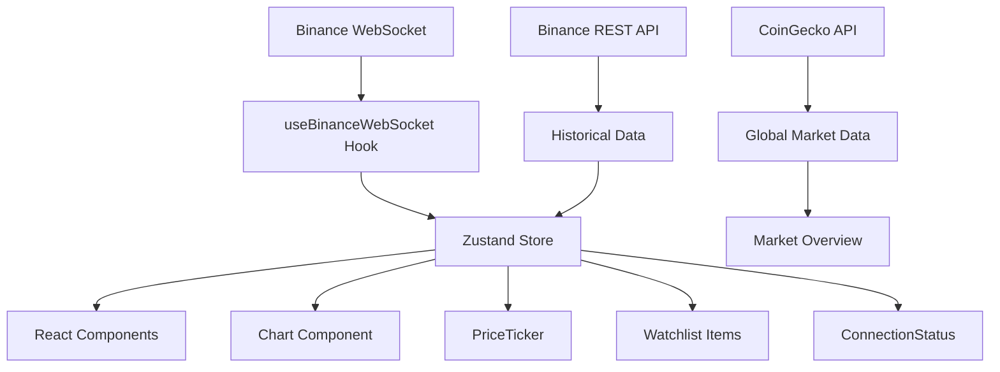

# CryptoVista

<div align="center">


**Professional cryptocurrency analytics platform with real-time data and advanced market insights**

[](https://your-demo-url.com)
[](https://vercel.com/new)

</div>

## 🎯 What is CryptoVista?

CryptoVista is a comprehensive cryptocurrency analytics platform designed for traders, investors, and crypto enthusiasts. It provides real-time market data, professional-grade charts, and advanced analytics tools to help users make informed decisions in the volatile crypto market.

### 🎯 Purpose & Target Audience

- **Traders**: Real-time price monitoring and technical analysis
- **Investors**: Portfolio tracking and market overview
- **Developers**: Learning modern web development with crypto APIs
- **Crypto Enthusiasts**: Staying updated with market trends

## ✨ Key Features

- 🔴 **Real-Time Data**: WebSocket connection to Binance for instant price updates
- 📊 **Professional Charts**: Interactive candlestick charts with lightweight-charts v5
- 💰 **Multiple Cryptocurrencies**: Support for BTC, ETH, SOL with instant switching
- 📈 **Market Overview**: Global market stats, top gainers/losers, and comprehensive market data
- 🔍 **Advanced Analytics**: Multi-chart dashboard with customizable layouts
- 📊 **Compare Mode**: Side-by-side price evolution comparison
- 📱 **Watchlist Management**: Create and manage custom cryptocurrency watchlists
- 🎨 **Modern UI**: Dark theme with professional design and smooth animations
- ⚡ **Ultra Fast**: Next.js 15 with Turbopack for instant development
- 🔄 **Smart Reconnection**: Exponential backoff for reliable WebSocket connections
- 📱 **Fully Responsive**: Perfect experience on desktop and mobile devices

## 🛠️ Technology Stack

| Technology | Version | Purpose |
|------------|---------|---------|
| **Next.js** | 15.5.4 | React framework with SSR/SSG |
| **TypeScript** | 5.0 | Static typing and better DX |
| **Tailwind CSS** | 4.0 | Utility-first CSS framework |
| **Zustand** | 5.0.8 | Lightweight state management |
| **lightweight-charts** | 5.0.9 | Professional financial charts |
| **Binance API** | REST + WS | Free market data |
| **CoinGecko API** | REST | Global market statistics |

## 🏗️ Project Architecture

### 📁 File Structure
```
src/
├── app/                          # Next.js App Router
│   ├── analytics/                # Multi-chart analytics dashboard
│   ├── market-overview/          # Global market overview
│   ├── compare/                  # Price comparison tool
│   ├── layout.tsx               # Main application layout
│   └── page.tsx                 # Landing page
├── components/                   # React components
│   ├── layout/                  # Layout components
│   │   ├── AppLayout.tsx        # Main app wrapper
│   │   ├── Navbar.tsx           # Navigation bar
│   │   └── Sidebar.tsx          # Collapsible sidebar
│   ├── analytics/               # Analytics components
│   │   ├── ChartCard.tsx        # Individual chart component
│   │   ├── GridLayout.tsx       # Chart grid layout
│   │   └── LayoutControls.tsx   # Layout customization
│   ├── watchlist/               # Watchlist management
│   │   ├── WatchlistGroup.tsx   # Watchlist container
│   │   ├── WatchlistItem.tsx    # Individual watchlist item
│   │   ├── AddWatchlistModal.tsx # Create new watchlist
│   │   └── AddTokenModal.tsx    # Add tokens to watchlist
│   ├── Chart.tsx                # Main candlestick chart
│   ├── PriceTicker.tsx          # Price display component
│   ├── ConnectionStatus.tsx     # WebSocket status indicator
│   └── SymbolSelector.tsx       # Cryptocurrency selector
├── hooks/                       # Custom React hooks
│   ├── useBinanceWebSocket.ts   # WebSocket data management
│   ├── useBinanceTicker.ts      # 24hr ticker data
│   └── useBinanceChart.ts       # Historical chart data
├── store/                       # Zustand state management
│   ├── marketStore.ts           # Main market data
│   ├── tickerStore.ts           # 24hr ticker data
│   ├── watchlistStore.ts        # Watchlist management
│   └── uiStore.ts               # UI state management
├── types/                       # TypeScript definitions
│   ├── market.ts                # Market data interfaces
│   ├── ticker.ts                # Ticker data interfaces
│   └── watchlist.ts             # Watchlist interfaces
└── utils/                       # Utility functions
    ├── symbolMapper.ts          # Symbol mapping utilities
    └── coingecko.ts             # CoinGecko API utilities
```

### 🔄 Data Flow Architecture



## 🚀 Quick Start

```bash
# Clone the repository
git clone https://github.com/Vicent00/crypto-tracker.git
cd crypto-tracker

# Install dependencies
npm install

# Start development server
npm run dev
```

Open [http://localhost:3000](http://localhost:3000) in your browser 🎉

## 📋 Available Scripts

```bash
# Development with Turbopack (ultra fast)
npm run dev

# Production build
npm run build

# Production server
npm start

# Linting and type checking
npm run lint
npx tsc --noEmit
```

## 📊 API Integration

### Binance WebSocket (Real-Time)
- **URL**: `wss://stream.binance.com:9443/stream`
- **Streams**: `{symbol}@trade` and `{symbol}@kline_1m`
- **Data**: Real-time prices, trades, and candlesticks

### Binance REST (Historical)
- **Endpoint**: `https://api.binance.com/api/v3/klines`
- **Parameters**: `symbol`, `interval=1m`, `limit=500`
- **Data**: 500 historical candlesticks (8+ hours)

### CoinGecko API (Market Data)
- **Endpoint**: `https://api.coingecko.com/api/v3`
- **Data**: Global market statistics, top cryptocurrencies
- **Rate Limit**: 10-50 calls/minute (free tier)

## 🎨 Core Components

### 📈 Chart Component
- Professional candlestick charts with lightweight-charts
- Zoom, pan, and interactive tools
- Custom color schemes (green/red)
- Responsive and optimized for performance

### 💰 PriceTicker
- Large price display with animations
- Color-coded price change indicators
- Automatic currency formatting
- Real-time updates

### 📊 Market Overview
- Global cryptocurrency market statistics
- Top gainers and losers
- Sortable market cap table
- Real-time data updates every 60 seconds

### 🔍 Analytics Dashboard
- Multi-chart layout with customizable grids
- Individual chart management
- Real-time WebSocket connections per chart
- Professional trading interface

### 📋 Watchlist Management
- Create custom cryptocurrency watchlists
- Add/remove tokens dynamically
- Real-time price tracking
- Persistent storage with localStorage

## ⚙️ Configuration

### Environment Variables
No API keys required. The project uses public endpoints from Binance and CoinGecko.

### Customization Options
- **Symbols**: Modify supported cryptocurrencies in components
- **Colors**: Adjust color palette in `tailwind.config.js`
- **Limits**: Change data limits in store configurations
- **Intervals**: Modify chart update frequencies

## 🚀 Deployment

### Vercel (Recommended)
```bash
# Install Vercel CLI
npm i -g vercel

# Deploy
vercel
```

### Docker
```dockerfile
FROM node:18-alpine
WORKDIR /app
COPY package*.json ./
RUN npm ci --only=production
COPY . .
RUN npm run build
EXPOSE 3000
CMD ["npm", "start"]
```

## 🔧 Development Features

### State Management
- **Zustand**: Lightweight state management
- **Modular Stores**: Separate stores for different data types
- **TypeScript**: Full type safety throughout the application

### Performance Optimizations
- **Next.js 15**: Latest framework with Turbopack
- **Image Optimization**: Next.js Image component
- **Code Splitting**: Automatic route-based splitting
- **WebSocket Efficiency**: Smart reconnection and data management

### Developer Experience
- **TypeScript**: Full type safety
- **ESLint**: Code quality enforcement
- **Hot Reload**: Instant development feedback
- **Responsive Design**: Mobile-first approach

## 🤝 Contributing

1. Fork the project
2. Create your feature branch (`git checkout -b feature/AmazingFeature`)
3. Commit your changes (`git commit -m 'Add some AmazingFeature'`)
4. Push to the branch (`git push origin feature/AmazingFeature`)
5. Open a Pull Request

## 📝 Roadmap

- [ ] Additional time intervals (5m, 15m, 1h, 4h, 1d)
- [ ] More cryptocurrencies (ADA, DOT, MATIC, etc.)
- [ ] Technical indicators (RSI, MACD, Bollinger Bands)
- [ ] Customizable price alerts
- [ ] Light/dark theme toggle
- [ ] Data export to CSV
- [ ] PWA (Progressive Web App)
- [ ] Push notifications
- [ ] Portfolio tracking
- [ ] Advanced charting tools

## 🐛 Known Issues

- **WebSocket errors in SSR**: Normal during server-side rendering, resolves on client
- **Rate limiting**: CoinGecko API has rate limits on free tier
- **Browser compatibility**: Requires modern browsers with WebSocket support

## 📄 License

This project is licensed under the MIT License. See `LICENSE` for more details.

## 🙏 Acknowledgments

- [Binance](https://binance.com) for the free API
- [CoinGecko](https://coingecko.com) for market data
- [TradingView](https://tradingview.com) for inspiration
- [lightweight-charts](https://tradingview.github.io/lightweight-charts/) for the charts
- [Vercel](https://vercel.com) for hosting

---

<div align="center">

**Built with ❤️ by [Vicente Aguilar](https://github.com/Vicent00)**
