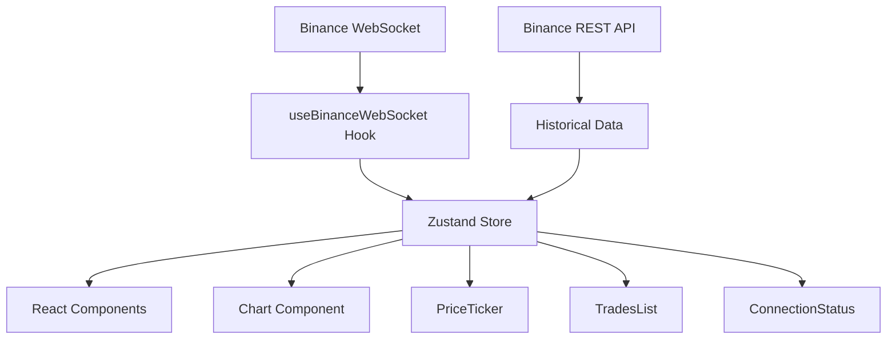

#  Crypto Tracker Dashboard

<div align="center">


**Dashboard de criptomonedas en tiempo real con gráficos profesionales y datos de Binance**

[](https://your-demo-url.com)
[](https://vercel.com/new)

</div>

## ✨ Características

- 🔴 **Datos en Tiempo Real**: Conexión WebSocket a Binance para precios y trades instantáneos
- 📊 **Gráficos Profesionales**: Candlesticks interactivos con lightweight-charts v5
- 💰 **Múltiples Criptos**: Soporte para BTC, ETH y SOL con cambio instantáneo
- 📈 **Historial Completo**: Carga automática de 500 velas históricas (8+ horas)
- 🎨 **UI Moderna**: Diseño oscuro con Tailwind CSS y animaciones suaves
- ⚡ **Ultra Rápido**: Next.js 15 con Turbopack para desarrollo instantáneo
- 🔄 **Reconexión Inteligente**: Backoff exponencial automático en caso de desconexión
- 📱 **Responsive**: Funciona perfectamente en desktop y móvil

## 🛠️ Tecnologías

| Tecnología | Versión | Propósito |
|------------|---------|-----------|
| **Next.js** | 15.5.4 | Framework React con SSR/SSG |
| **TypeScript** | 5.0 | Tipado estático y mejor DX |
| **Tailwind CSS** | 4.0 | Estilos utilitarios y diseño |
| **Zustand** | 5.0.8 | Estado global minimalista |
| **lightweight-charts** | 5.0.9 | Gráficos financieros profesionales |
| **Binance API** | REST + WS | Datos de mercado gratuitos |

## 🚀 Instalación Rápida

```bash
# Clonar el repositorio
git clone https://github.com/tu-usuario/crypto-tracker.git
cd crypto-tracker

# Instalar dependencias
npm install

# Iniciar servidor de desarrollo
npm run dev
```

Abre [http://localhost:3000](http://localhost:3000) en tu navegador 🎉

## 📋 Scripts Disponibles

```bash
# Desarrollo con Turbopack (ultra rápido)
npm run dev

# Build de producción
npm run build

# Servidor de producción
npm start

# Linter y verificación de tipos
npm run lint
npx tsc --noEmit
```

## 🏗️ Arquitectura del Proyecto

```
src/
├── app/                    # App Router de Next.js
│   ├── layout.tsx          # Layout principal
│   └── page.tsx            # Página principal
├── components/             # Componentes React
│   ├── Chart.tsx           # Gráfico de velas interactivo
│   ├── ConnectionStatus.tsx # Estado de conexión WebSocket
│   ├── PriceTicker.tsx     # Display de precio principal
│   ├── SymbolSelector.tsx  # Selector de criptomonedas
│   └── TradesList.tsx      # Lista de trades recientes
├── hooks/                  # Custom hooks
│   └── useBinanceWebSocket.ts # Hook principal de datos
├── store/                  # Estado global
│   └── marketStore.ts      # Store de Zustand
└── types/                  # Definiciones TypeScript
    └── market.ts           # Interfaces de datos
```

## 🔄 Flujo de Datos



## 📊 APIs Utilizadas

### Binance WebSocket (Tiempo Real)
- **URL**: `wss://stream.binance.com:9443/stream`
- **Streams**: `{symbol}@trade` y `{symbol}@kline_1m`
- **Datos**: Precios, trades y velas en tiempo real

### Binance REST (Histórico)
- **Endpoint**: `https://api.binance.com/api/v3/klines`
- **Parámetros**: `symbol`, `interval=1m`, `limit=500`
- **Datos**: 500 velas históricas (8+ horas)

## 🎨 Componentes Principales

### 📈 Chart Component
- Gráfico de velas profesionales con lightweight-charts
- Zoom, pan y herramientas interactivas
- Colores personalizados (verde/rojo)
- Responsive y optimizado

### 💰 PriceTicker
- Display grande del precio actual
- Animaciones de color en cambios de precio
- Formato de moneda automático
- Indicador de símbolo

### 📋 TradesList
- Lista de últimos 50 trades
- Indicadores BUY/SELL con colores
- Timestamps formateados
- Scroll automático

### 🔌 ConnectionStatus
- Estado visual de conexión WebSocket
- Indicadores: Conectado, Conectando, Error
- Animaciones de estado

## ⚙️ Configuración

### Variables de Entorno
No se requieren API keys. El proyecto usa endpoints públicos de Binance.

### Personalización
- **Símbolos**: Modifica `SYMBOLS` en `SymbolSelector.tsx`
- **Colores**: Ajusta la paleta en `tailwind.config.js`
- **Límites**: Cambia `MAX_TRADES` y `MAX_CANDLES` en el store

## 🚀 Deployment

### Vercel (Recomendado)
```bash
# Instalar Vercel CLI
npm i -g vercel

# Deploy
vercel
```

### Docker
```dockerfile
FROM node:18-alpine
WORKDIR /app
COPY package*.json ./
RUN npm ci --only=production
COPY . .
RUN npm run build
EXPOSE 3000
CMD ["npm", "start"]
```

## 🤝 Contribuir

1. Fork el proyecto
2. Crea una rama para tu feature (`git checkout -b feature/AmazingFeature`)
3. Commit tus cambios (`git commit -m 'Add some AmazingFeature'`)
4. Push a la rama (`git push origin feature/AmazingFeature`)
5. Abre un Pull Request

## 📝 Roadmap

- [ ] Más intervalos de tiempo (5m, 15m, 1h, 4h, 1d)
- [ ] Más criptomonedas (ADA, DOT, MATIC, etc.)
- [ ] Indicadores técnicos (RSI, MACD, Bollinger Bands)
- [ ] Alertas de precio personalizables
- [ ] Modo oscuro/claro
- [ ] Exportar datos a CSV
- [ ] PWA (Progressive Web App)
- [ ] Notificaciones push

## 🐛 Problemas Conocidos

- **WebSocket errors en SSR**: Normal durante server-side rendering, se resuelve en el cliente
- **Duplicate keys en desarrollo**: Solucionado con deduplicación en el store
- **EPERM en Windows**: Problema de permisos con `.next/trace`, solucionable ejecutando como admin

## 📄 Licencia

Este proyecto está bajo la Licencia MIT. Ver `LICENSE` para más detalles.

## 🙏 Agradecimientos

- [Binance](https://binance.com) por la API gratuita
- [TradingView](https://tradingview.com) por la inspiración
- [lightweight-charts](https://tradingview.github.io/lightweight-charts/) por los gráficos
- [Vercel](https://vercel.com) por el hosting

---

<div align="center">

**Hecho con ❤️ por [Tu Nombre]**

[⭐ Star este repo](https://github.com/tu-usuario/crypto-tracker) | [🐛 Reportar bug](https://github.com/tu-usuario/crypto-tracker/issues) | [💡 Sugerir feature](https://github.com/tu-usuario/crypto-tracker/issues)

</div>